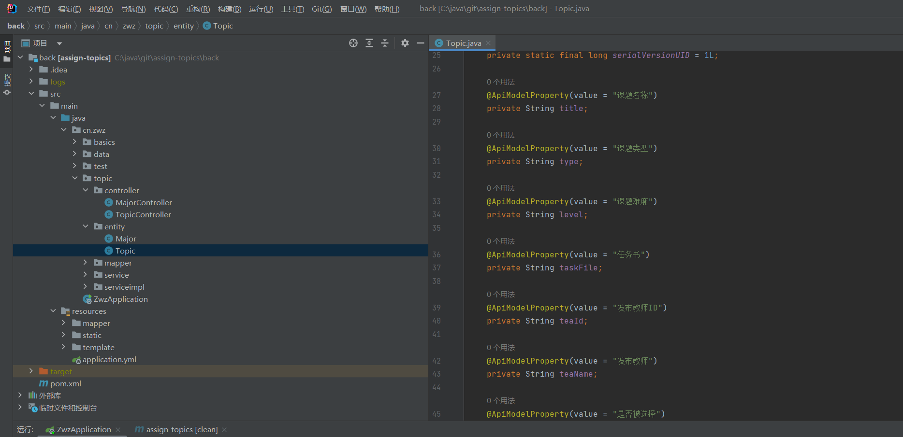
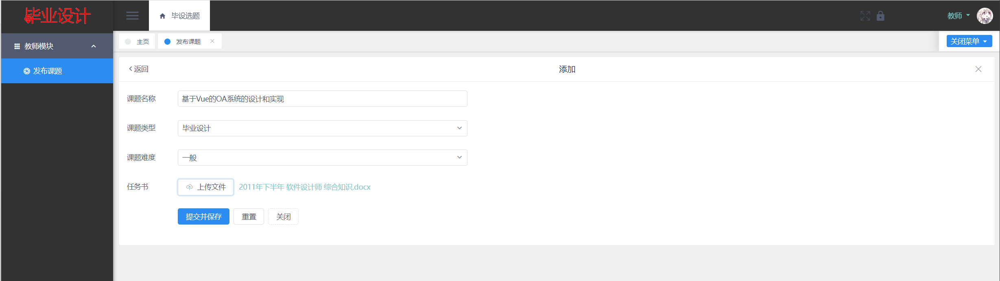
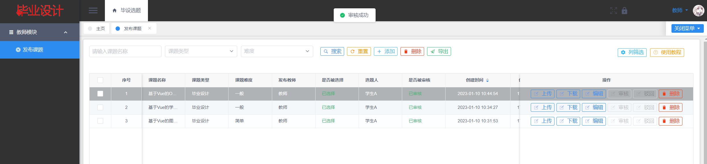

# 毕设分配选题管理系统

## 软件简介

系统支持学生、老师、教务管理员三个角色使用，是一个简洁版的毕设选题系统，另外还包括基础的用户管理、文件管理、角色管理、日志管理等。

**老师**：发布毕业设计课题、上传任务书、审核学生的选题。

**学生**：选择老师发布的毕业设计课题、取消选择课题、下载任务书、查询我的选题。

**教务管理员**：专业档案的运维、用户/角色/权限的管理，以及系统基础的管理。

如您对该系统有技术问题，或有更好的建议，可以在 <https://bbs.csdn.net/topics/611866407> 贴吧中进行反馈。

## 后端项目架构

## 前端项目架构

## 登录模块

## 用户注册

## 登录后主页

## 管理员模块

专业档案维护

添加/编辑页面

## 教师模块

### 发布课题

## 学生模块

选择课题

选择课题成功反馈

 可在我的选题模块中取消选择。

此时回到教师模块，可以进行审核操作。

审核成功后反馈如下。

 审核完成后，整体业务逻辑结束。

## 其他模块

用户管理

部门管理

云盘（文件管理）

日志管理

数据字典

各类图等

## 免责声明

- 本项目开源，仅供个人学习使用，遵循 GPL-3.0 开源协议，**转发 / 商用授权请联系作者，否则后果自负**。
- 作者拥有本软件构建后的应用系统全部内容所有权及独立的知识产权。
- 如有问题，欢迎在仓库 Issue 留言，看到后会第一时间回复。相关意见会酌情考虑，但没有一定被采纳的承诺或保证。

下载本系统代码的用户，**必须同意以下内容，否则请勿下载**！

1. 出于自愿而使用/开发本软件，了解使用本软件的风险，且同意自己承担使用本软件的风险。
2. 利用本软件构建的网站的任何信息内容以及导致的任何版权纠纷和法律争议及后果和作者无关，作者对此不承担任何责任。
3. 在任何情况下，对于因使用或无法使用本软件而导致的任何难以合理预估的损失（包括但不仅限于商业利润损失、业务中断与业务信息丢失），作者概不承担任何责任。
4. 必须了解使用本软件的风险，作者不承诺提供一对一的技术支持、使用担保，也不承担任何因本软件而产生的难以预料的问题的相关责任。
